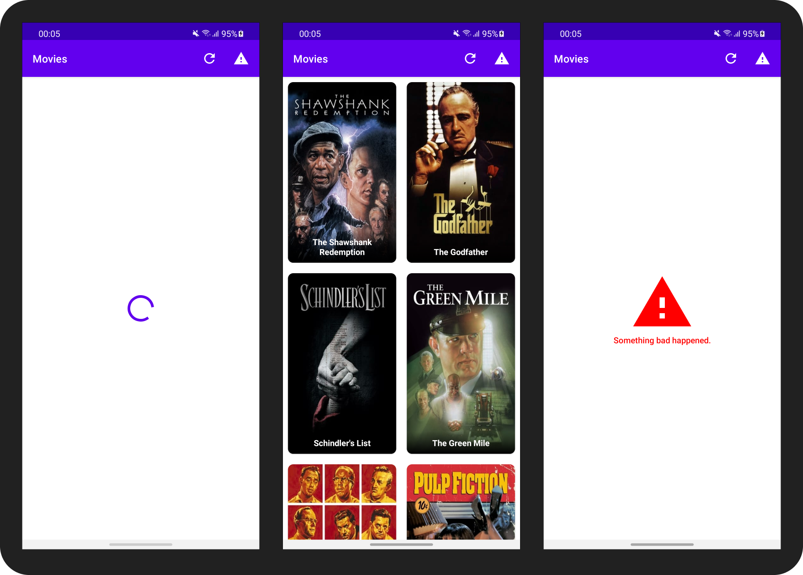

# About
A sample project that demonstrates mocking HTTP requests by reading local JSON files
using [OkHttp],[Retrofit], and [Coroutines]. [This article] describes the details about the codebase.

[OkHttp]: https://github.com/square/okhttp
[Retrofit]: https://github.com/square/retrofit
[Coroutines]: https://github.com/Kotlin/kotlinx.coroutines
[This article]: https://medium.com/@murattuzel/mockever-you-want-cee95b3b459

